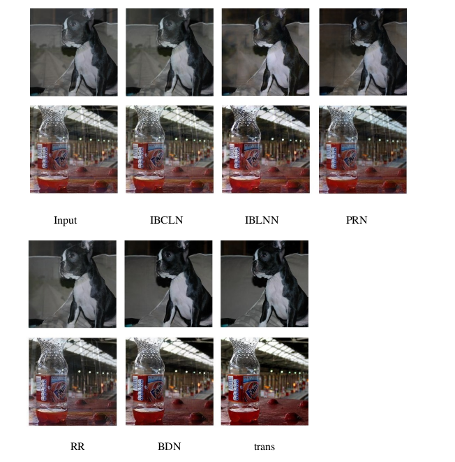
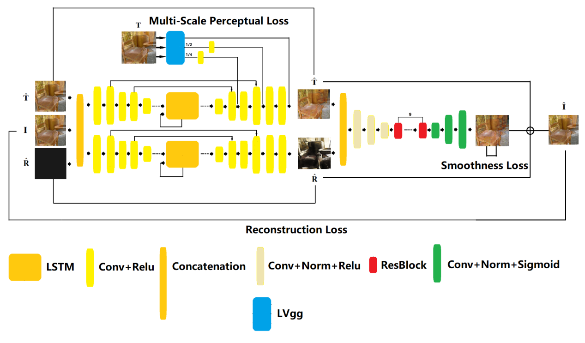
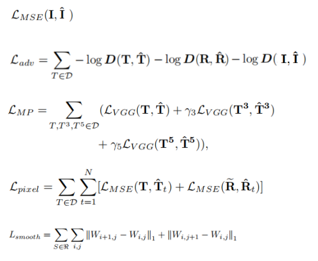
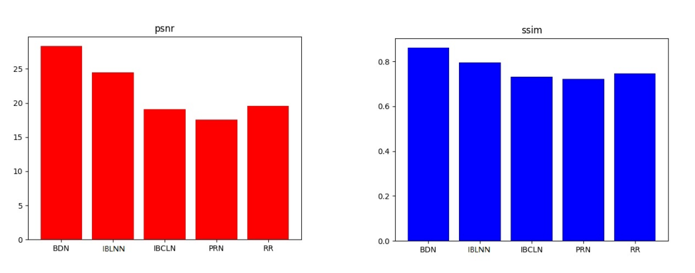
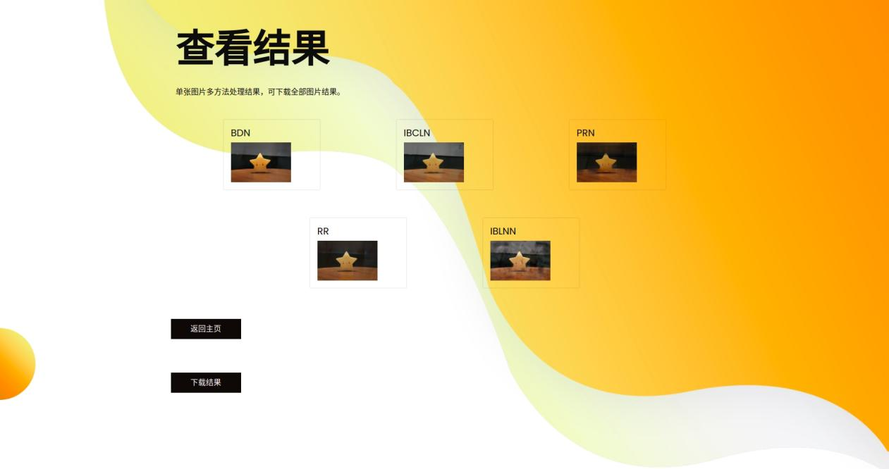
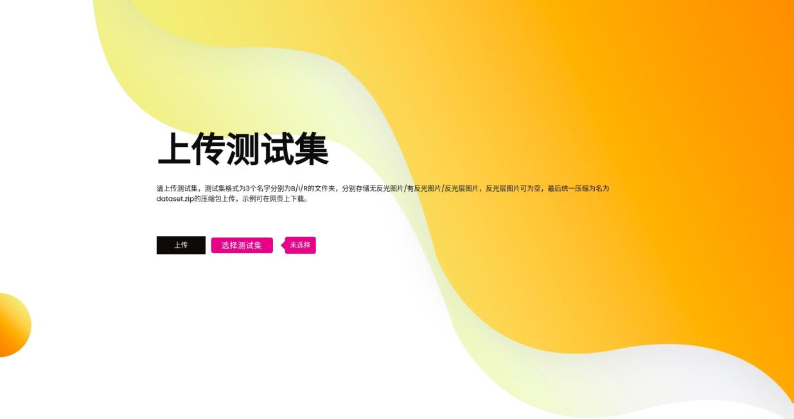

# Single-Image-Reflection-Removal-Toolkit
This is a Toolkit uses five different models to remove the reflection on single image.The results of the removal (including PSNR/SSIM and the image after reflection removal) will be obtained by using a web-application constructed by flask.

## Refection Removal Results

## Five models
1 BDN 
  Seeing Deeply and Bidirectionally: A Deep Learning Approach for Single Image Reflection Removal 
  Jie Yang\*, Dong Gong\*, Lingqiao Liu, Qinfeng Shi.(ECCV 2018) 

2 IBCLN 
  Single Image Reflection Removal through Cascaded Refinement 
  Chao Li, Yixiao Yang, Kun He, Stephen Lin, John E. Hopcroft.(CVPR 2020) 
  
3 PRN 
  Single Image Reflection Removal with Perceptual Losses 
  Xuaner Zhang, Ren Ng, Qifeng Chen.(CVPR 2018) 
  
4 RR 
  Single Image Reflection Removal with Physically-Based Training Images 
  Soomin Kim, Yuchi Huo, and Sung-Eui Yoon.(CVPR 2020) 
  
5 IBLNN 
  It's a model designed by me. The paper has not been publicted, so I will explain this model in the following paragraphs, thus to let the readers understand the details.
  
## IBLNN model

network structure 

loss functions 

model effects 

## Toolkit functions
1 Using one image with reflection as input, receiving five images (each uses a different model) as output. 

2 Using one testset as input(including image with reflection-I, image without reflection-B, residual image-R), receving PSNR/SSIM effects comparison and image after reflection removal as output. 

## Toolkit instructions
1 neccesary resources downloading 
[Supplment files](https://pan.baidu.com/s/1fF4x0eraelU1O1Ank77QSw) code: q5ro 
need to put the files into the right position in the toolkit folder 

2 Dataset 
[[DORM]](https://github.com/Eddie-Wang1120/Single-Image-Reflection-Removal-Dorm-Dataset) 
[[SIR2]](https://rose1.ntu.edu.sg/dataset/sir2Benchmark/) 
[[Wen et al. (syn)]](https://github.com/csqiangwen/Single-Image-Reflection-Removal-Beyond-Linearity#reflection-removal) 
[[BDN(syn)]](https://github.com/yangj1e/bdn-refremv#datasets) 
[[Zhang et al.]](https://drive.google.com/drive/folders/1NYGL3wQ2pRkwfLMcV2zxXDV8JRSoVxwA) 

3 tips 
When upload a testset to the web application, please change the test data into the right position(just like the example), compress the folder into the .zip format,and rename it to dataset.zip.
